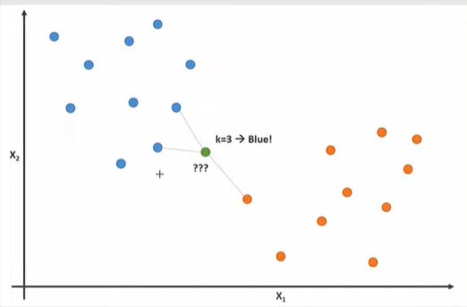

# Basic KNN Algorithm
This repo explores the basics of K-Nearest Neighbors algorithm from scratch. Enjoy!

### Software, Tools, and prerequisits
1. Access to Google Colab or some Jupyter Notebook.
2. Basic python programing.
3. Basic arithmetic knowledge

### Intro: What is K Nearest Neighbors?
Given a specific data point:

* Calculate its distance from all other points in the dataset.
* Get the closest K point (where K is a number/ threshold specificed by the user).

In Regression, the output of this specific data point would be the average/ mean of all it's K neighboring points while in Classification, the label of this specific data point would be the label of all it's K neighboring points.

### Steps to completing the project
1. Import the necessary modules/ packages needed for this project.
2. import the iris dataset and plot using only 2 of the 4 features for visualization.
3. Create the classifier:
    * Implement the $fit(X, y)$ method that takes in the $X$ and $y$ training sets.
    * Implement the $predict(X)$ method to take in a test vector and predict corresponding y labels.
4. Seperate your dataset into train-test splits.
5. Test your KNN Classifier and calculate its accuracy.